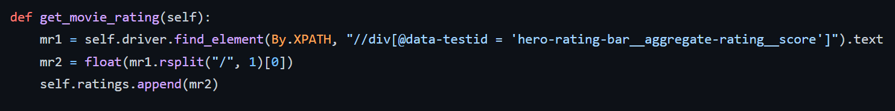
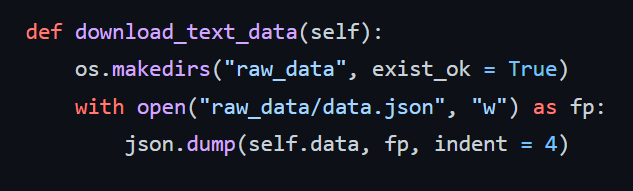
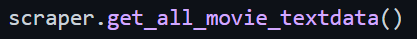

# Data Collection

Data collection project.

## Milestone 1

Set up git repo and coding environment.

## Milestone 2

Chose a site to collect data from.

Holidays:
- Agoda
- Wego

Entertainment:
- Rotten Tomatoes
- IMDB
- SoundCloud
- Metacritic
- A-Z Animals

Ecommerce:
- Lego
- Square Enix
- Ikea
- Trustpilot
- Ocado
- Waterstones
- John Lewis

Health and Nutrition:
- MyProtein
- Lamberts
- Gorilla Mind

Finance:
- Coin Market

## Milestone 3

Created data scraper class and populated it with methods to extract links and scrape useful movie data.

- For this scraper code, the webdriver module from selenium and the By module needed to be imported.

- The class was set up and the driver was set as the Chrome webdriver. The url was the url for the IMDB top movies site. Using  `self.driver.get(url)`, I was able to load the url of the site I wanted to scrape data from. `time.sleep(2)` was used to add a delay when loading the site to actually load the page quicker - loading it too fast made the site think a bot is trying to access it.

- An empty list for the links was intialised using `self.links = []` and then a method was set up to scrape the site for all of the top movie links and placed them into a list. Using `movie_list = self.driver.find_element(By.XPATH, "//tbody[@class = 'lister-list']")`, an xpath for the block containing the list of movies was identified and set to the variable name movie_list. Then this was used to go further into the children of the xpath using `movies = movie_list.find_elements(By.XPATH, "tr/td/a")` where it searches for every xpath that has a `tr` then a `td` and then finally an `a` tag, which is where every link for each movie was located. Instead of find_element, find_elements was used as there were multiple xpaths to be found.

- In order to iterate through every xpath that has a link to a movie in the list, a for loop is used: `for movie in movies:`. Using `1 = movie.get_attribute("href")`, the link is assigned to the variable l in each iteration and an if loop `if l no in self.links:` checked to see if the link was already in the list. If it was not, it was added to the list using `self.links.append(l)` and this was neccessary to eliminate duplicate links.

- The final block, `if __name__ = "__main__":` was added to ensure the class could only be run directly when called and not just be imported. Then an instance of the class was set up using `scraper = Scraper()`.

- The get_movie_links() method was called using `scraper.get_movie_links()` and a list of the links was printed to check the output using `print(scraper.links)`.

## Milestone 4

For milestone 4, the Scraper class was populated with several methods to extract each movie page for both text and image data. More methods were added to download this text data locally in a dictionary, aswell as the images. 

- The datetime, json and requests modules were imported too.

- The Scraper class was initialised just like the previous class with attributes initialised as empty lists. 

- The `get_id` method was used to get an id for each individual movie. It took a second argument `mt` which was assigned later as the movie link. Using `mt.rsplit("_", 1)[-1]`, the last element was spliced off the link (hence the -1 as it starts from the end of the string) which in this case was a number. Using `int()` the number was turned into an integer.

- The `get_timestamp` method was also called here to generate the timestamp when the id was taken and then the ids were all added to a list `self.ids`.

- The `get_timestamp` method used the time and datetime modules to generate not only a timestamp, but to change it into the format `dd-mm-YYYY_HH:MM:SS` to make it more readable and understandable. Then the timestamps were added to `self.timestamps`.

- This was the first method used to scrape data from the individual movie page. The `get_movie_title` method found the xpath containing the heading tag `h1` with the title block. Using `//h1` searched for every instance of h1 while `@data-testid = 'hero-title-block__title'` specified the id attribute to scrape. Finally the `.text` took the text element of the xpath which was the title here.

- The titles were added to the list `self.titles`.

- These next found an xpath to be used in the next 3 methods to scrape data. The `get_d1` method found the xpath containing the unordered list tag `ul`. This block contained 3 important pieces of data to be scraped including the release date, age rating and runtime for each movie.

- The `get_movie_release_date` method used the `self.d1` xpath and took the first list element `li[1]` which contained the release date and this value, initially taken as a string, was turned into an integer. They were then added to the list `self.release_dates`.

- The `get_movie_age_rating` method again used the `self.d1` xpath but took the second list element `li[2]` this time, which contained the age rating. Then they were added to the list of `self.age_ratings`.

- The `get_movie_runtime` method used this same `self.d1` xpath taking the final and third list element `li[3]`, which contained the runtime. Then they were added to the list of `self.runtimes`.

- The `get_g1` method was used to find the parent branch xpath for any of the movies genres by finding the xpath containing the container tag `div` and assigning it to `self.g1`. 

- The `get_movie_genre` method called `get_g1` and used `try` and `except` loops to iterate through different scenarios. 

- The first try loop tried to scrape 3 elements containing the `a` tag for each genre and they were added to a list `g5`. Then the elements in the list were seperated by a divider `/`. 

-If there were not 3 genres, the code in the except block would run, where there was another try and except block. This next try block was used to scrape 2 elements this time, added them to a list and seperated them by a `/` again. 

- If this try block failed again, the final part of code in the last except block was ran. Only the first element i.e. the only genre was scraped and assigned to g6. 

- Whether g6 contained 3, 2 or 1 genres, it was then added to the list `self.genres`.

- The `get_movie_rating` method was used to scrape the rating for each movie. First, the xpath containing this data with a container tag `div` was found. The rating was taken from here by taking the first element before the first `/` and was turned into a float value.

- Then it was added to the list `self.ratings`.

- The `get_all_movie_textdata` was used to combine all the existing methods in the class to scrape the list of movies and each movie for data. 

- The `self.get_movie_links()` method was called first and then using a `for` loop, the scraper iterated through each link using `for mt in self.links:` and `self.driver.get(mt)` which loaded the movie page at the start of each loop. 

- Then every method to scraped data was called and a dictionary `self.data` was created to add every list of data scraped too.  

- The `download_text_data` method was used to download all the scraped text data as a dictionary into a json file locally. 

- First, using `os.makedirs("raw_data", exist_ok = True)`, the path was set and the `raw_data` folder was created.

- Using `with open("raw_data/data.json", "w") as fp:` was used to select where to save the data using `w` to indicate that data was being written and `fp` was the file path. Then, `json.dump(self.data, fp, indent = 4)` turned the dictionary into the json file in the assigned file path and the `indent = 4` was used to present the data in the json file more clearly.

- The `get_movie_image` method was used to scrape the movie page for a reference image and then get the source link for it. First, the xpath was found containing the image tag `img` and `.get_attribute("src")` located the image source link available in this xpath.

- The image link was added to the list `self.images` and each link was returned from the method.

- The `download_image_data` method was used to download all the scraped image data locally as jpg files.

- The directory was set using `os.makedirs("raw_data/images", exist_ok = True)`, creating the images folder with the raw_data folder.

- The `self.get_movie_image` method was called and assigned to `img_url`. The image itself was loaded using `requests.get(img_url).content` and  assigned to `img_data`. 

- To make a name for each image, the datetime and id were taken and combined to make `img_name`.

- Finally, `with open(f"raw_data/images/{img_name}.jpg", 'wb') as handler:` and `handler.write(img_data)` wrote the image data into the selected file path as a jpg file.

- The `scraper.get_all_movie_textdata()` method was called using `scraper` as the instance to run the scraper. 

- Finally, `scraper.driver.quit()` was used to exit the Chrome webdriver.

## Milestone 5

## Milestone 6

# Milestone 7